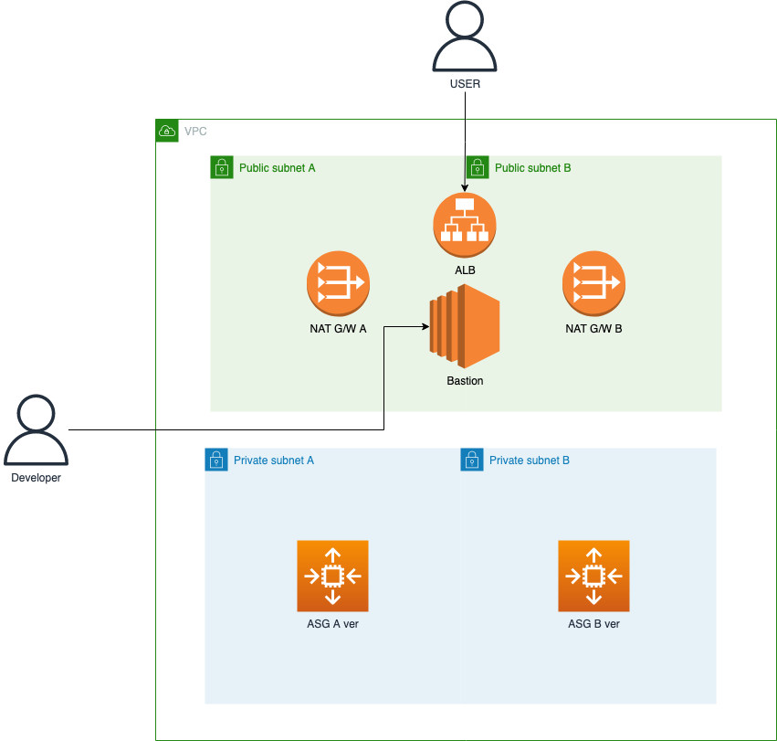

# A-B-Testing

## 1. Architecture

## 2. Intro

`A/B Testing`이란 두 가지 Version의 Application을 배포하여 어떤 Version이 새로운 사용자의 유입과 매출 향상에 도움이 되는지 검증해보는 것을 뜻합니다.

기존의 UI와 새로 개발한 UI중 어떤 것을 사용자들이 더 선호하는지 A/B Testing을 통해 검증하여 선택하게 되는 것이죠.

지금부터 AWS와 Express를 사용하여 A/B Testing을 구현해보도록 하겠습니다.

## 3. Velog

[EC2 서비스를 활용한 A/B Testing](https://velog.io/@ribjeong04/AWS-EC2-%EC%84%9C%EB%B9%84%EC%8A%A4%EB%A5%BC-%ED%99%9C%EC%9A%A9%ED%95%9C-AB-Testing)
